# Cozip Final ERD Document

## 1. Purpose of This Document

This document defines the **target-state finalized ERD** for the **full-fledged production version** of Cozip, not just the current project version.

This means the schema below is designed for the **final scalable ecommerce system** that supports:

- registered users
- guest checkout
- wishlist and cart persistence
- product catalog and variants
- coupon and discount flows
- payment and order lifecycle
- shipment and tracking history
- admin roles and internal operations
- email campaigns
- support tickets and customer communication
- verified reviews

This document should be treated as the **future database source of truth** for backend planning.

---

## 2. Design Principles Used in This ERD

This ERD is designed with these principles:

1. **Scalable**: must support a growing product catalog, many users, and many orders.
2. **Normalized**: avoid unnecessary duplication while keeping practical reporting support.
3. **Guest-friendly**: a customer should be able to place and track orders without mandatory account creation.
4. **Auditable**: order status, payment, inventory, and shipping events should be traceable.
5. **Extensible**: future modules like returns, loyalty, and vendor support should be addable without major schema rewrite.
6. **Production-oriented**: designed for a real ecommerce backend, not only demo UI flows.

---

## 3. High-Level Domain Modules

The final database is divided into these main modules:

1. Identity and Access
2. Catalog and Inventory
3. Customer Experience
4. Cart and Wishlist
5. Checkout and Orders
6. Payments and Refunds
7. Shipment and Tracking
8. Promotions and Discounts
9. Reviews and Support
10. Admin, Marketing, and Audit

---

## 4. Final Target-State ERD

```mermaid
erDiagram
    AUTH_USERS ||--|| USER_PROFILES : owns
    USER_PROFILES ||--o{ USER_ADDRESSES : has
    ROLES ||--o{ USER_ROLE_ASSIGNMENTS : assigned_in
    USER_PROFILES ||--o{ USER_ROLE_ASSIGNMENTS : receives

    CATEGORIES ||--o{ PRODUCTS : groups
    COLLECTIONS ||--o{ PRODUCT_COLLECTIONS : includes
    PRODUCTS ||--o{ PRODUCT_COLLECTIONS : belongs_to
    PRODUCTS ||--o{ PRODUCT_VARIANTS : has
    PRODUCTS ||--o{ PRODUCT_MEDIA : has
    PRODUCT_VARIANTS ||--o{ PRODUCT_MEDIA : can_show
    PRODUCT_VARIANTS ||--o{ INVENTORY_MOVEMENTS : tracked_by

    USER_PROFILES ||--o{ WISHLISTS : owns
    WISHLISTS ||--o{ WISHLIST_ITEMS : contains
    PRODUCT_VARIANTS ||--o{ WISHLIST_ITEMS : saved_as

    USER_PROFILES ||--o{ CARTS : owns
    CARTS ||--o{ CART_ITEMS : contains
    PRODUCT_VARIANTS ||--o{ CART_ITEMS : selected_as

    USER_PROFILES ||--o{ ORDERS : places
    USER_ADDRESSES ||--o{ ORDERS : used_for
    COUPONS ||--o{ COUPON_REDEMPTIONS : redeemed_in
    USER_PROFILES ||--o{ COUPON_REDEMPTIONS : redeems
    ORDERS ||--o{ COUPON_REDEMPTIONS : applies

    ORDERS ||--|{ ORDER_ITEMS : contains
    PRODUCT_VARIANTS ||--o{ ORDER_ITEMS : purchased_as
    ORDERS ||--o{ ORDER_STATUS_HISTORY : changes_over_time
    ORDERS ||--o{ PAYMENTS : paid_by
    PAYMENTS ||--o{ PAYMENT_TRANSACTIONS : logs
    ORDERS ||--o{ REFUNDS : may_have

    ORDERS ||--o{ SHIPMENTS : fulfilled_by
    SHIPMENTS ||--o{ SHIPMENT_EVENTS : tracked_by
    COURIERS ||--o{ SHIPMENTS : ships

    USER_PROFILES ||--o{ PRODUCT_REVIEWS : writes
    PRODUCTS ||--o{ PRODUCT_REVIEWS : receives
    ORDER_ITEMS ||--o| PRODUCT_REVIEWS : verifies_purchase

    USER_PROFILES ||--o{ SUPPORT_TICKETS : creates
    ORDERS ||--o{ SUPPORT_TICKETS : related_to
    SUPPORT_TICKETS ||--o{ SUPPORT_MESSAGES : contains
    USER_PROFILES ||--o{ SUPPORT_MESSAGES : sends

    EMAIL_TEMPLATES ||--o{ EMAIL_CAMPAIGNS : powers
    EMAIL_CAMPAIGNS ||--o{ EMAIL_CAMPAIGN_RECIPIENTS : targets
    USER_PROFILES ||--o{ EMAIL_CAMPAIGN_RECIPIENTS : receives

    USER_PROFILES ||--o{ NOTIFICATIONS : receives
    USER_PROFILES ||--o{ AUDIT_LOGS : performs

    AUTH_USERS {
      uuid id PK
      string email
      string phone
      boolean email_confirmed
      boolean phone_confirmed
      datetime last_sign_in_at
      datetime created_at
    }

    USER_PROFILES {
      uuid id PK
      uuid auth_user_id FK
      string first_name
      string last_name
      string display_name
      string avatar_url
      string customer_code
      string status
      string default_currency
      boolean is_guest
      datetime created_at
      datetime updated_at
    }

    USER_ADDRESSES {
      uuid id PK
      uuid user_profile_id FK
      string label
      string recipient_name
      string phone
      string address_line_1
      string address_line_2
      string city
      string state_region
      string postal_code
      string country_code
      boolean is_default_shipping
      boolean is_default_billing
      datetime created_at
    }

    ROLES {
      uuid id PK
      string code
      string name
      string description
    }

    USER_ROLE_ASSIGNMENTS {
      uuid id PK
      uuid user_profile_id FK
      uuid role_id FK
      uuid assigned_by FK
      datetime assigned_at
    }

    CATEGORIES {
      uuid id PK
      uuid parent_category_id FK
      string name
      string slug
      string description
      boolean is_active
      int sort_order
    }

    COLLECTIONS {
      uuid id PK
      string name
      string slug
      string description
      boolean is_featured
      datetime starts_at
      datetime ends_at
    }

    PRODUCT_COLLECTIONS {
      uuid id PK
      uuid product_id FK
      uuid collection_id FK
    }

    PRODUCTS {
      uuid id PK
      uuid category_id FK
      string name
      string slug
      text description
      string short_description
      string brand
      string material
      string care_instructions
      string shipping_info
      boolean is_active
      boolean is_featured
      decimal average_rating
      int review_count
      datetime created_at
      datetime updated_at
    }

    PRODUCT_VARIANTS {
      uuid id PK
      uuid product_id FK
      string sku
      string variant_name
      string color
      string size
      string capacity
      string dimensions
      string weight
      decimal price
      decimal compare_at_price
      int stock_on_hand
      int reserved_stock
      boolean is_default
      boolean is_active
      datetime created_at
      datetime updated_at
    }

    PRODUCT_MEDIA {
      uuid id PK
      uuid product_id FK
      uuid product_variant_id FK
      string media_type
      string storage_path
      string public_url
      string alt_text
      int sort_order
      boolean is_primary
      datetime created_at
    }

    INVENTORY_MOVEMENTS {
      uuid id PK
      uuid product_variant_id FK
      string movement_type
      int quantity_delta
      string reference_type
      uuid reference_id
      string notes
      uuid created_by FK
      datetime created_at
    }

    WISHLISTS {
      uuid id PK
      uuid user_profile_id FK
      string name
      boolean is_default
      datetime created_at
    }

    WISHLIST_ITEMS {
      uuid id PK
      uuid wishlist_id FK
      uuid product_variant_id FK
      datetime created_at
    }

    CARTS {
      uuid id PK
      uuid user_profile_id FK
      string session_token
      string status
      string currency_code
      datetime expires_at
      datetime created_at
      datetime updated_at
    }

    CART_ITEMS {
      uuid id PK
      uuid cart_id FK
      uuid product_variant_id FK
      int quantity
      decimal unit_price
      datetime created_at
      datetime updated_at
    }

    COUPONS {
      uuid id PK
      string code
      string discount_type
      decimal discount_value
      decimal minimum_order_value
      decimal maximum_discount_value
      int usage_limit
      int usage_count
      boolean is_active
      datetime starts_at
      datetime ends_at
      datetime created_at
    }

    COUPON_REDEMPTIONS {
      uuid id PK
      uuid coupon_id FK
      uuid user_profile_id FK
      uuid order_id FK
      string redeemed_code_snapshot
      decimal discount_amount
      datetime redeemed_at
    }

    ORDERS {
      uuid id PK
      string order_number
      uuid user_profile_id FK
      uuid shipping_address_id FK
      uuid billing_address_id FK
      string customer_email
      string customer_phone
      string customer_name
      string order_source
      string order_status
      string payment_status
      string fulfillment_status
      string currency_code
      decimal subtotal_amount
      decimal discount_amount
      decimal shipping_amount
      decimal tax_amount
      decimal total_amount
      string notes
      boolean is_guest_order
      datetime placed_at
      datetime created_at
      datetime updated_at
    }

    ORDER_ITEMS {
      uuid id PK
      uuid order_id FK
      uuid product_variant_id FK
      string product_name_snapshot
      string sku_snapshot
      decimal unit_price
      int quantity
      decimal line_total
      datetime created_at
    }

    ORDER_STATUS_HISTORY {
      uuid id PK
      uuid order_id FK
      string old_status
      string new_status
      string notes
      uuid changed_by FK
      datetime changed_at
    }

    PAYMENTS {
      uuid id PK
      uuid order_id FK
      string payment_method
      string payment_provider
      string payment_status
      decimal amount
      string provider_reference
      datetime authorized_at
      datetime captured_at
      datetime created_at
    }

    PAYMENT_TRANSACTIONS {
      uuid id PK
      uuid payment_id FK
      string transaction_type
      decimal amount
      string gateway_reference
      string response_code
      json provider_payload
      datetime created_at
    }

    REFUNDS {
      uuid id PK
      uuid order_id FK
      uuid payment_id FK
      decimal refund_amount
      string refund_reason
      string refund_status
      datetime requested_at
      datetime processed_at
    }

    COURIERS {
      uuid id PK
      string name
      string code
      string website_url
      string support_phone
      boolean is_active
    }

    SHIPMENTS {
      uuid id PK
      uuid order_id FK
      uuid courier_id FK
      string shipment_number
      string tracking_number
      string shipping_method
      string shipment_status
      string origin_city
      string destination_city
      datetime shipped_at
      datetime estimated_delivery_at
      datetime delivered_at
      datetime created_at
    }

    SHIPMENT_EVENTS {
      uuid id PK
      uuid shipment_id FK
      string event_code
      string status_label
      text description
      string location_name
      datetime occurred_at
      boolean is_customer_visible
    }

    PRODUCT_REVIEWS {
      uuid id PK
      uuid product_id FK
      uuid user_profile_id FK
      uuid order_item_id FK
      int rating
      text title
      text comment
      boolean is_verified_purchase
      boolean is_approved
      datetime created_at
      datetime updated_at
    }

    SUPPORT_TICKETS {
      uuid id PK
      uuid user_profile_id FK
      uuid order_id FK
      string ticket_number
      string subject
      string category
      string priority
      string status
      datetime created_at
      datetime updated_at
    }

    SUPPORT_MESSAGES {
      uuid id PK
      uuid ticket_id FK
      uuid sender_user_profile_id FK
      string sender_type
      text message_body
      boolean is_internal_note
      datetime created_at
    }

    EMAIL_TEMPLATES {
      uuid id PK
      string name
      string subject
      text html_body
      text text_body
      boolean is_active
      datetime created_at
      datetime updated_at
    }

    EMAIL_CAMPAIGNS {
      uuid id PK
      uuid email_template_id FK
      string name
      string campaign_type
      string status
      datetime scheduled_at
      datetime sent_at
      uuid created_by FK
      datetime created_at
    }

    EMAIL_CAMPAIGN_RECIPIENTS {
      uuid id PK
      uuid email_campaign_id FK
      uuid user_profile_id FK
      string email_address_snapshot
      string delivery_status
      datetime delivered_at
      datetime opened_at
      datetime clicked_at
    }

    NOTIFICATIONS {
      uuid id PK
      uuid user_profile_id FK
      string notification_type
      string title
      text body
      string related_entity_type
      uuid related_entity_id
      boolean is_read
      datetime created_at
      datetime read_at
    }

    AUDIT_LOGS {
      uuid id PK
      uuid actor_user_profile_id FK
      string action_type
      string entity_type
      uuid entity_id
      json metadata
      datetime created_at
    }
```

---

## 5. Core Entity Decisions

## 5.1 Identity and Access

### AUTH_USERS

This is the authentication-level user table. In a Supabase-based production system, this would map to `auth.users`.

Purpose:

- login credentials
- auth provider identity
- email/phone verification state
- last sign-in tracking

### USER_PROFILES

This is the application-level customer/admin profile table.

Why separate it from auth users:

- auth and application data should not be mixed
- profile fields can grow without touching auth table
- guest profiles can also be represented
- roles and customer metadata become easier to manage

### USER_ROLE_ASSIGNMENTS and ROLES

Needed for:

- customer role
- admin role
- super_admin role
- support_agent role
- marketing_manager role

This is better than a single `role` column because full-fledged systems often need multi-role support.

---

## 5.2 Catalog and Inventory

### PRODUCTS vs PRODUCT_VARIANTS

The final system should not store all purchasable info only in `products`.

Why variants are necessary:

- one mug can have multiple capacities, colors, or sizes
- pricing may differ by variant
- stock should be tracked per actual sellable variant
- wishlist/cart/order should reference exact sellable unit

So:

- `products` = parent catalog entity
- `product_variants` = actual sellable SKU-level records

### PRODUCT_MEDIA

Media is separated because:

- a product can have multiple images
- a variant can have variant-specific media
- sort order and alt text should be stored cleanly

### INVENTORY_MOVEMENTS

This is included because full-fledged commerce systems need inventory history, not only stock quantity.

Examples:

- manual stock add
- stock correction
- order reservation
- order cancellation release
- damaged item deduction

---

## 5.3 Customer Experience Tables

### WISHLISTS and WISHLIST_ITEMS

Wishlist is separated into two tables so a user can eventually support:

- default wishlist
- named wishlists
- public/private wishlists later if needed

### CARTS and CART_ITEMS

Cart is also a separate entity because:

- one user may have an active cart and abandoned carts
- guest cart can be represented using `session_token`
- cart totals should not replace order totals

Important design decision:

- cart is temporary
- order is permanent

---

## 5.4 Orders and Checkout

### ORDERS

This is the central transactional table.

It is designed to support both:

- logged-in users
- guest users

How guest checkout is supported:

- `user_profile_id` can be nullable in implementation if needed
- `customer_email`, `customer_phone`, and `customer_name` are stored as snapshots
- `is_guest_order` tells whether checkout was guest-based

This is essential because the project already supports guest-style flows.

### ORDER_ITEMS

Snapshots are stored here intentionally.

Examples:

- `product_name_snapshot`
- `sku_snapshot`
- `unit_price`

Why snapshot fields matter:

- product details may change later
- order history must remain historically accurate

### ORDER_STATUS_HISTORY

This is needed so order progress remains auditable.

Examples:

- pending → confirmed
- confirmed → packed
- packed → shipped
- shipped → delivered
- delivered → returned

---

## 5.5 Payments and Refunds

### PAYMENTS

Stores payment record at business level.

### PAYMENT_TRANSACTIONS

Stores gateway-level technical transactions.

Why split them:

- one payment can have multiple technical events
- authorization and capture may be separate
- webhook logs may generate multiple transaction rows

### REFUNDS

Necessary for real ecommerce lifecycle.

Even if refunds are not implemented today, the final ERD should include them because changing transaction architecture later is expensive.

---

## 5.6 Shipment and Tracking

### SHIPMENTS

An order may create one or more shipments.

Why not keep shipment fields directly in orders only:

- split shipments can happen
- different couriers may be used
- fulfillment and order logic should be separate

### SHIPMENT_EVENTS

This is critical for the guest tracking flow requested in the project.

It stores:

- event status
- location
- timestamp
- customer-visible progress updates

This directly supports:

- track order page
- order details timeline
- courier progress history

---

## 5.7 Promotions and Discounts

### COUPONS

Stores discount definitions.

Supports:

- flat discounts
- percentage discounts
- time limits
- usage limits
- minimum order amount
- maximum discount cap

### COUPON_REDEMPTIONS

Tracks when and where coupons are used.

Why separate table is needed:

- avoid duplicate use abuse
- support analytics
- show coupon history
- tie discount amount to exact order

---

## 5.8 Reviews and Support

### PRODUCT_REVIEWS

This table supports verified purchase review logic.

Important field:

- `order_item_id`

This lets you prove the reviewer actually purchased the product.

### SUPPORT_TICKETS and SUPPORT_MESSAGES

This is required for a final production system because the project already has a contact/help concept.

Production support should not remain only a contact form. It should evolve into:

- ticket creation
- status tracking
- threaded conversation
- internal notes

---

## 5.9 Marketing and Admin Operations

### EMAIL_TEMPLATES

Stores reusable email designs.

Examples:

- welcome email
- order confirmation
- shipping update
- password reset

### EMAIL_CAMPAIGNS

Represents an actual campaign instance.

### EMAIL_CAMPAIGN_RECIPIENTS

Stores per-user delivery/open/click tracking.

### AUDIT_LOGS

This is important for admin traceability.

Examples:

- admin deleted a product
- support changed ticket status
- manager updated coupon rules

---

## 6. Mandatory Constraints for Final Implementation

These rules should be enforced at database level.

### Unique Constraints

- `auth_users.email` unique
- `user_profiles.customer_code` unique
- `categories.slug` unique
- `collections.slug` unique
- `products.slug` unique
- `product_variants.sku` unique
- `coupons.code` unique
- `orders.order_number` unique
- `support_tickets.ticket_number` unique
- `shipments.tracking_number` unique if carrier requires uniqueness

### Check Constraints

- rating between 1 and 5
- stock values cannot be negative without explicit business rule
- usage counts cannot exceed usage limits unless null/unlimited design is used
- total amounts cannot be negative

### Foreign Key Rules

- deleting a product should not silently break order history
- deleting a user should not erase financial records
- order-linked records should generally be restricted or soft-deleted

---

## 7. Recommended Soft Delete Strategy

For the final production version, these tables should use soft delete instead of hard delete in most cases:

- products
- product_variants
- categories
- collections
- coupons
- user_profiles
- email_templates

Suggested field:

- `deleted_at`

Why:

- preserves history
- improves recovery
- avoids orphan business references

---

## 8. Recommended Enumerations

These can be implemented either as check constraints or lookup tables.

### order_status

- pending
- confirmed
- packed
- shipped
- delivered
- cancelled
- returned

### payment_status

- pending
- authorized
- paid
- failed
- refunded
- partially_refunded

### fulfillment_status

- unfulfilled
- partially_fulfilled
- fulfilled
- returned

### shipment_status

- pending
- label_created
- picked_up
- in_transit
- out_for_delivery
- delivered
- failed_delivery
- returned_to_sender

### ticket_status

- open
- in_progress
- waiting_customer
- resolved
- closed

### discount_type

- percentage
- fixed_amount
- free_shipping

---

## 9. Indexing Strategy for the Final System

Recommended indexes:

### Catalog

- `products.slug`
- `products.category_id`
- `products.is_featured`
- `product_variants.product_id`
- `product_variants.sku`

### Orders

- `orders.order_number`
- `orders.user_profile_id`
- `orders.customer_email`
- `orders.order_status`
- `orders.placed_at`

### Shipments

- `shipments.order_id`
- `shipments.tracking_number`
- `shipment_events.shipment_id`
- `shipment_events.occurred_at`

### Reviews

- `product_reviews.product_id`
- `product_reviews.user_profile_id`

### Support

- `support_tickets.user_profile_id`
- `support_tickets.order_id`
- `support_tickets.status`

---

## 10. Final Notes About Guest Checkout and Tracking

Because the project now supports guest-oriented order detail and tracking behavior, the final schema must support guest orders properly.

That means:

- account creation is optional for checkout
- orders must store customer snapshot details
- shipment tracking must be accessible by order number and verified contact data
- order data must remain valid even if no registered profile exists

In production, the recommended guest tracking validation flow is:

1. user enters order number
2. system verifies email or phone
3. system opens tracking details

So although the current UI may use order ID lookup only, the final schema already supports more secure guest tracking implementation.

---

## 11. Final Recommended Build Order for Backend Development

If this ERD is implemented in phases, use this sequence:

1. auth users and user profiles
2. categories, products, product variants, product media
3. carts and wishlists
4. orders and order items
5. payments and coupons
6. shipments and shipment events
7. reviews and support tickets
8. email campaigns and audit logs

This order minimizes rework.

---

## 12. Final Summary

This ERD is designed for the **final mature version of Cozip**.

It is intentionally bigger than the current project because the goal is to avoid redesigning the data model later when the product becomes a full ecommerce platform.

The most important final design decisions are:

- separate auth and profile layers
- use product variants instead of only products
- support both guest and registered orders
- separate orders, payments, shipments, and tracking events
- keep review, support, coupon, marketing, and audit modules first-class

If implemented as defined here, this schema will support a serious production ecommerce system with minimal structural rework later.